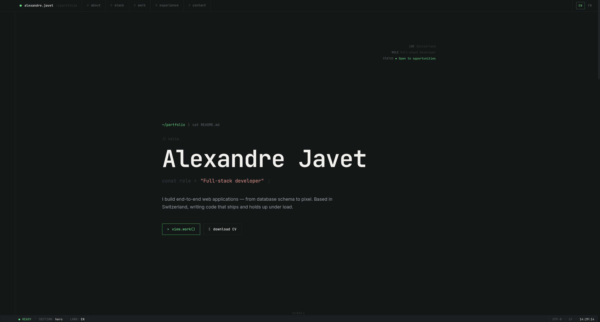
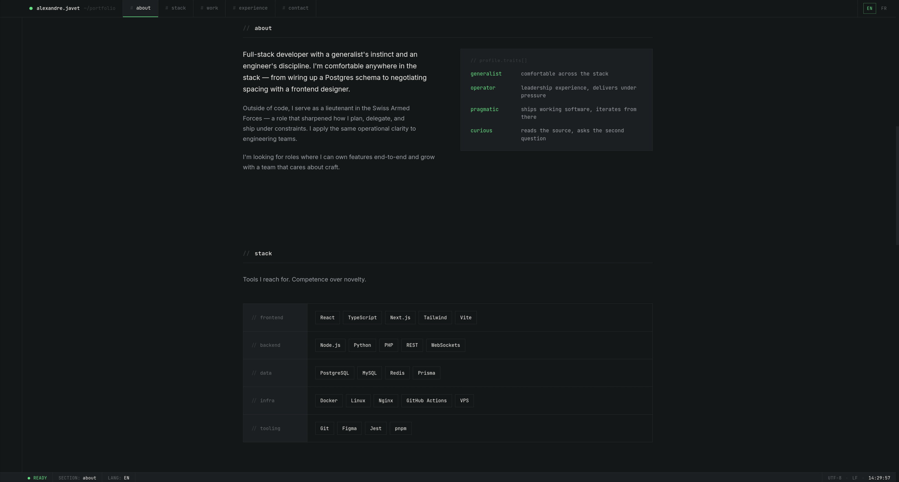
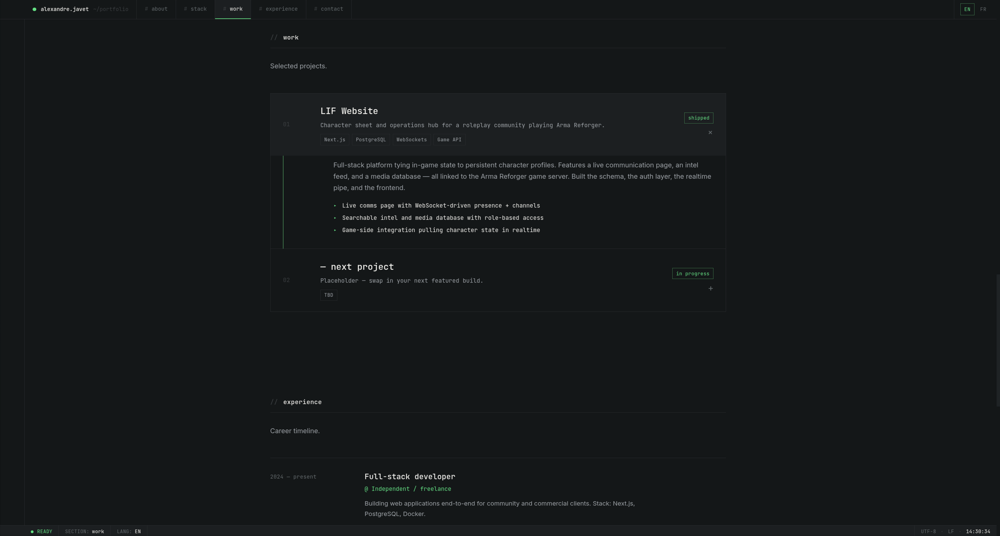
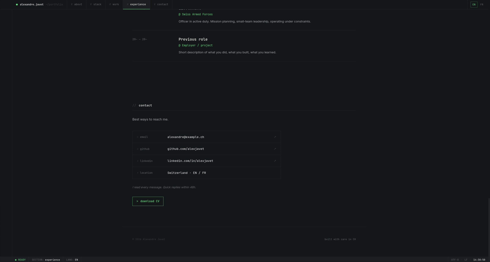

# Personnal website for recruiters.

## Summary

This is my personnal website aimed to advertise myself for potential job opportunities to recruiters who may stumble upon it either via Linkedin or spontaneous application.

## Objective

Have a mobile and desktop friendly platform, easily accessible by anybody even if they are not comfortable with technology. It must also be easily modifiable, which is the reason I integrated `Strapi` into the project, making it easy for me to add posts, pages or modify information without having to modify my code.

## Technical specs

### Tech Stack

- React
- Vite
- Typescript
- Strapi
- sqlite
- docker

### Design principles

Design was made with _claude design_. Code is 100% made by hand.

- **Tone:** Technical, dense, IDE/terminal-inspired but elevated — not a caricature of a terminal. Think editorial take on dev tools: monospace as structure, generous whitespace, precise typography.
- **Type:** JetBrains Mono (primary, monospace) + Inter (secondary, for long-form reading) — both on Google Fonts, widely supported in Swiss/EU tech aesthetic.
- **Color:** Deep off-black background (oklch(0.18 0.005 240)), bone/paper foreground (oklch(0.96 0.005 85)), muted slate for secondary (oklch(0.65 0.01 240)). Single accent: terminal green (oklch(0.78 0.15 150)) used sparingly for cursor, active states, prompts.
- **Layout:** Grid-based with visible guides (like an editor gutter). Line numbers in left margin. Sticky status bar at bottom (IDE pattern).
- **Motion:** Typing cursor, subtle reveal on scroll, syntax-highlight hover states. Restrained.
  Swiss sensibility: lots of negative space, left-aligned type, no decorative fluff. Cross flag as a subtle nod only.

_Homepage concept_

_About concept_

_Work concept_

_Contact concept_
